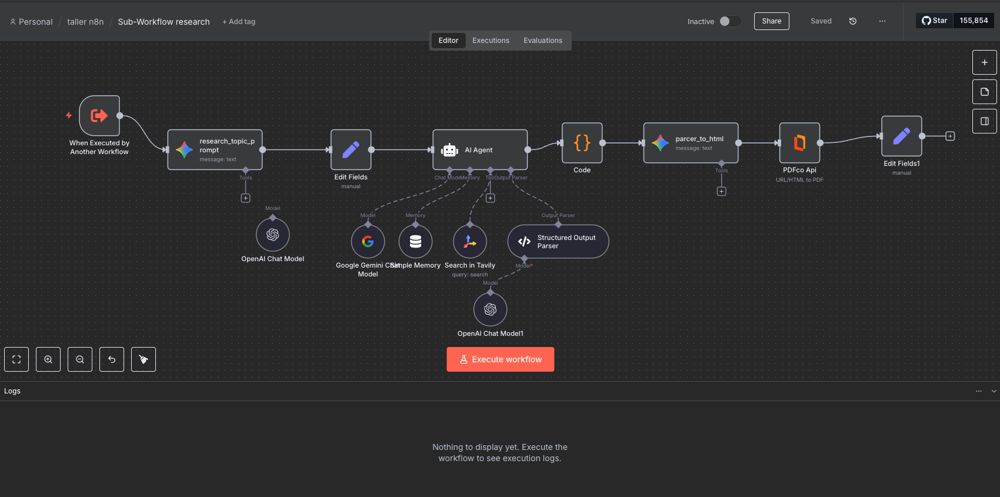

# Taller de n8n: Agente de Investigación Automatizado

Este instructivo guía la creación de un agente conversacional para investigación general, realiza búsquedas web con Tavily, organiza hallazgos, genera un informe en PDF con fuentes citadas, todo dentro de n8n.

## Objetivo
- Construir un agente principal con chat, memoria y una herramienta que invoca un subworkflow de investigación.
- Crear el subworkflow que refina el brief, busca en la web, estructura resultados, genera HTML y exporta a PDF.
- Entregar un informe ejecutivo y un enlace público al PDF.

## Preparación
- Crear cuenta en n8n Cloud (free trial): https://app.n8n.cloud/register
- Crear cuenta en Tavily y obtener API Key: https://tavily.com/ (Docs: https://docs.tavily.com/)
- Obtener API Key de Gemini (Google AI Studio / Google Cloud): 
  - [Google Cloud Console](https://console.cloud.google.com/marketplace/product/google/generativelanguage.googleapis.com)
  - [Google AI Studio](https://ai.google.dev/aistudio) (Docs: https://ai.google.dev/gemini-api/docs)
  - Modelo recomendado: `models/gemini-2.5-flash`.
- Crear cuenta en PDF.co y obtener API Key: https://pdf.co/

En n8n:
- Instalar nodos de comunidad si no aparecen:
  - Settings → Community Nodes → Install:
    - `@tavily/n8n-nodes-tavily`
    - `@pdfco/n8n-nodes-pdfco`
- Crear credenciales (esto se hará durante el taller):
  - `Google Gemini (PaLM)` → pega tu API key.
  - `Tavily API` → pega tu API key.
  - `PDF.co` → pega tu API key.

## Arquitectura
- Conversación en Chat → Agente Principal → Sub-Workflow → HTML → PDF.

## Parte 1: Agente Principal (desde cero)

1) Crear workflow
- Nombre: `Research Agent taller n8n`.

2) Nodo: Chat Trigger
- Añadir “Chat Trigger” (AI). Dejar opciones por defecto.
- Conectar salida a “AI Agent”.


3) Nodo: AI Agent
- Añadir “AI Agent”.
- En “System message”, copiar el prompt del workflow:

```text
You are a research assistant conducting research on the user's input topic. For context, today's date is {{$today.format('yyyy-MM-dd')}}.

Speak in Spanish by default! If the user speaks in another language, speak in that language.

You have access to a comprehensive research tool that can conduct deep analysis on any topic. When a user requests research, ALWAYS ask 1-2 clarifying questions first to ensure you conduct the most valuable and targeted research possible.

## When to use the research tool:
- User asks for research on specific topics, technologies, companies, or markets
- User wants to understand trends, opportunities, or competitive landscapes  
- User needs market analysis, technical insights, or strategic recommendations
- User asks questions like "research X", "analyze Y", "tell me about Z market", "what's happening with [technology]"

## Before conducting research, ask clarifying questions such as:

**For technology research:**
- "Are you more interested in the technical capabilities, market adoption, or commercial applications of [technology]?"
- "What specific industry or use case are you most interested in?"
- "Are you looking at this from an investment perspective, competitive analysis, or implementation opportunity?"

**For market research:**
- "What geographic region are you most interested in - global, US, Europe, or a specific market?"
- "Are you looking for current market size, growth projections, or competitive landscape?"
- "What's your primary focus - market opportunities, barriers to entry, or key players?"

**For company/competitive research:**
- "Are you interested in their technology, business model, market position, or recent developments?"
- "Should I focus on specific product lines or their overall strategic direction?"
- "Are you looking at them as a potential partner, competitor, or investment opportunity?"

## After getting clarification:
Combine the clarified brief with the research tool. If the brief is clear, proceed to call the Sub-Workflow research with the fields: brief, language, sessionId.
```

4) Nodo: Google Gemini Chat Model
- Añadir “Google Gemini Chat Model”.
- Credenciales: selecciona tu cuenta de Gemini.
- Modelo: `models/gemini-2.5-flash`.
- Conectar a la entrada `ai_languageModel` del “AI Agent”.

5) Nodo: Simple Memory
- Añadir “Simple Memory” (Buffer window). Opcional: `contextWindowLength` 8–12.
- Conectar a la entrada `ai_memory` del “AI Agent”.

6) Nodo: Tool Workflow (crear y llamar subworkflow)
- Añadir “Tool: n8n Workflow”.
- Configurar entradas del workflow:
  - `brief`: `={{ /*n8n-auto-generated-fromAI-override*/ $fromAI('brief', ``, 'string') }}`
  - `sessionId`: `={{ $json.sessionId }}`
  - `language`: `={{ /*n8n-auto-generated-fromAI-override*/ $fromAI('language', ``, 'string') }}`
- Descripción de herramienta (copiar exactamente la del workflow):

```text
Transforms a structured research brief into a deep, AI-powered research report and returns ready-to-share assets.

Input format (JSON object):
{
  "brief": "<concise research brief with topic, context, goals and key questions>",
  "sessionId": "<session identifier>",
  "language": "<user language, e.g. 'English', 'Spanish', etc.>"
}

Behavior:
When called, this tool:
- Performs multi-step research across multiple, up-to-date sources.
- Prioritizes credible references and cross-checks key facts.
- Writes the report in the language specified by `language`.
- Generates a complete HTML research report suitable for conversion to PDF.

Output format (array with one result object):
[
  {
    "research": "<full research report in HTML>",
    "executive_summary": "<short textual summary of the main findings>",
    "sources": [
      { "title": "<source title>", "url": "<source URL>" }
    ],
    "research_url": "<public URL of the generated PDF version of the report>"
  }
]

Field semantics:
- `research`: Full, well-structured research report in HTML (headings, paragraphs, lists, sources section, etc.).
- `executive_summary`: High-level summary that can be shown directly to the user or used for follow-up questions.
- `sources`: List of the main sources used in the research, with titles and URLs for citation and transparency.
- `research_url`: Direct link to the PDF version of the report. The calling agent SHOULD show this URL to the user so they can open, download, or share the complete report.
```

- Crear el subworkflow desde este nodo:
  - En el selector de workflow, elige “Create new workflow / Create sub-workflow”.
  - Nombra el nuevo subworkflow: `Sub-Workflow research`.
  - n8n abrirá el editor del subworkflow en una nueva pestaña/ventana.

7) Conexiones
- “When chat message received” → “AI Agent” (main).
- “Simple Memory” → “AI Agent” (ai_memory).
- “Google Gemini Chat Model” → “AI Agent” (ai_languageModel).
- “Call n8n Workflow Tool” → “AI Agent” (ai_tool).

8) Activar workflow
- Guarda y activa.
- Abre el chat embebido en n8n para probar.

---

## Parte 2: Sub-Workflow de Investigación (desde cero)

1) Crear workflow
- Nombre: `Sub-Workflow research`.

2) Nodo: Execute Workflow Trigger
- Añadir “When Executed by Another Workflow”.
- Entradas: `brief`, `sessionId`, `language`.

3) Nodo: Prompt para refinar objetivo (Gemini)
- Añadir “Google Gemini” (`models/gemini-2.5-flash`).
- Mensaje (copiar exactamente):

```text
You will be given a set of messages that have been exchanged so far between yourself and the user. 
Your job is to translate these messages into a more detailed and concrete research question that will be used to guide the research.

The messages that have been exchanged so far between yourself and the user are:
<Messages>
{{ $json.brief }}
</Messages>

Today's date is {{ $today.format('yyyy-MM-dd') }}.

You will return a single research question that will be used to guide the research.

Guidelines:
1. Maximize Specificity and Detail
- Include all known user preferences and explicitly list key attributes or dimensions to consider.
- It is important that all details from the user are included in the instructions.

2. Handle Unstated Dimensions Carefully
- When research quality requires considering additional dimensions that the user hasn't specified, acknowledge them as open considerations rather than assumed preferences.
- Only mention dimensions that are genuinely necessary for comprehensive research in that domain.

3. Avoid Unwarranted Assumptions
- Never invent specific user preferences, constraints, or requirements that weren't stated.
- If the user hasn't provided a particular detail, explicitly note this lack of specification.

4. Distinguish Between Research Scope and User Preferences
- Research scope: What topics/dimensions should be investigated (can be broader than user's explicit mentions)
- User preferences: Specific constraints, requirements, or preferences (must only include what user stated)

Language: {{ $('When Executed by Another Workflow').item.json.language || 'Spanish' }} by default.
```

4) Nodo: Set “Edit Fields”
- Añadir “Set”. Campos:
  - `sessionId`: `={{ $('When Executed by Another Workflow').item.json.sessionId }}`
  - `brief`: `={{ $json.content.parts[0].text }}`
  - `language`: `={{ $('When Executed by Another Workflow').item.json.language }}`

5) Nodo: AI Agent (investigación con Tavily)
- Añadir “AI Agent”.
- Prompt type: Define.
- Text: `={{ $json.brief }}`
- System message (copiar):

```text
You are a research assistant. Date: {{ $today.format('yyyy-MM-dd') }}. Language: {{ $json.language }}.

<Task>
Conduct web research using available tools to answer the brief comprehensively.
</Task>

<Available Tools>
- tavily_search: web searches for relevant, recent information.
</Available Tools>

<Instructions>
1. Read the brief carefully.
2. Start with broad searches; then narrow to fill gaps.
3. After each search, assess what's missing.
4. Stop when you can answer confidently.

<Hard Limits>
- Simple queries: 2–3 tool calls max.
- Complex queries: up to 5 tool calls max.
- Stop if last 2 searches return similar info or if you have 3+ solid sources.

<Show Your Thinking>
Briefly reflect after each search: key info found; gaps; need for more.

OUTPUT_SCHEMA (strict):
{
  "topic": "string",
  "executive_summary": "string (80–200 words)",
  "report_markdown": "string (markdown; include inline refs [1], [2] mapped to sources)",
  "sources": [ { "title": "string", "url": "string" } ]
}

Return exactly that JSON. Write in {{ $json.language || 'Spanish' }} by default.
```

6) Nodo: Google Gemini Chat Model
- Añadir “Google Gemini Chat Model”. Conectar como `ai_languageModel` al AI Agent.

7) Nodo: Tavily Tool
- Añadir “Search in Tavily”.
- Credenciales: tu API key de Tavily.
- Campo `query`:
  - `={{ /*n8n-auto-generated-fromAI-override*/ $fromAI('Query', `queries especificas a investigar!`, 'string') }}`
- Conectar como `ai_tool` al AI Agent.

8) Nodo: Simple Memory
- Añadir “Simple Memory” y conectarla a `ai_memory` del AI Agent.

9) Nodo: Structured Output Parser
- Añadir “Structured Output Parser”. JSON Schema Example:

```json
{
  "topic": "string",
  "executive_summary": "string (80-200 words)",
  "report_markdown": "string (markdown, include inline refs like [1], [2])",
  "sources": [ { "title": "string", "url": "string" } ]
}
```

- Conexión de LLM:
  - Opción A: “OpenAI Chat Model” → parser.
  - Opción B: “Google Gemini Chat Model” → parser.
- Conectar el parser como `ai_outputParser` al AI Agent.

10) Nodo: Code (formatear fuentes)
- Añadir “Code”. Copiar:

```javascript
for (const item of $input.all()) {
  const sources = $input.first().json.output.sources ?? [];
  const markdownSources = sources.map((src, index) => `[${index+1}] [${src.title}](${src.url})`);
  item.json.sources_markdown = markdownSources.join('\n');
}
return $input.all();
```

11) Nodo: HTML (Gemini) “parcer_to_html”
- Añadir “Google Gemini” (`models/gemini-2.5-flash`).
- Mensaje (copiar exactamente como en el workflow):

```text
Based on all the research conducted, create a comprehensive, well-structured HTML report for the overall research.

For context, today's date is {{ $today.format('yyyy-MM-dd') }} and language is 
{{ $('Edit Fields').item.json.language }}

<Research Topic>
{{ $json.output.topic }}
</Research Topic>

<Research report>
{{ $json.output.report_markdown }}
</Research report>

<Sources>
{{ $json.sources_markdown }}
</Sources>

CRITICAL: Make sure the answer is written in the same language specified at the beginning! 
If no language is specified, Spanish MUST be used by default.

OUTPUT FORMAT REQUIREMENTS
You MUST output a single, valid HTML document. Do NOT use Markdown. Do NOT wrap the HTML in backticks.
Use this structure:

<html>
  <head>
    <meta charset="UTF-8" />
    <title>Research Report</title>
    <style>
      body { font-family: system-ui, -apple-system, BlinkMacSystemFont, "Segoe UI", sans-serif; line-height: 1.6; }
      h1, h2, h3 { margin-top: 1.2em; }
      ul, ol { margin-left: 1.5em; }
      .meta-block { font-size: 0.95em; color: #555; margin-bottom: 1.5em; }
      .sources-list li { margin-bottom: 0.2em; }
      .exec-summary { border: 1px solid #ddd; padding: 1em 1.2em; margin-bottom: 2em; background: #fafafa; }
      .exec-summary h2 { margin-top: 0; }
    </style>
  </head>
  <body>
    <!-- Your content goes here -->
  </body>
</html>

Inside <body>, you MUST:
1. Start with:
   - <h1> as the main title of the report (use the research topic).
   - A small meta block (<p class="meta-block">) that includes the preparation date and the language of the report.
   - A COMPLETE EXECUTIVE SUMMARY SECTION wrapped in a <div class="exec-summary"> (title translated to target language).
2. Include main sections and “Sources” list using the provided markdown refs.
```

12) Nodo: PDF.co Api
- Añadir “PDFco Api”.
- Operación: “URL/HTML to PDF”.
- Convert Type: “htmlToPDF”.
- Campo `html`: `={{ $json.content.parts[0].text }}`
- Credenciales: tu cuenta de PDF.co.

13) Nodo: Set “Edit Fields1” (salida final)
- Añadir “Set”. Campos:
  - `research`: `={{ $('parcer_to_html').item.json.content.parts[0].text }}`
  - `executive_summary`: `={{ $('Code').item.json.output.executive_summary }}`
  - `sources`: `={{ $('Code').item.json.output.sources }}`
  - `research_url`: `={{ $json.url }}`

14) Conexiones del subworkflow
- Trigger → `research_topic_prompt` → “Edit Fields” → “AI Agent” → “Code” → “parcer_to_html” → “PDFco Api” → “Edit Fields1”.
- “Google Gemini Chat Model” → “AI Agent” (ai_languageModel).
- “Search in Tavily” → “AI Agent” (ai_tool).
- “Simple Memory” → “AI Agent” (ai_memory).
- “Structured Output Parser” → “AI Agent” (ai_outputParser).
- “OpenAI Chat Model” (o Gemini) → “Structured Output Parser” (ai_languageModel).



15) Activar workflow
- Guarda y activa el Sub-Workflow.

---

## Prueba de punta a punta
- Abre el chat del Agente Principal.
- Escribe: “Investiga el estado actual de ‘RAG con GraphRAG’ aplicado a banca en LatAm; objetivo: proponer piloto; foco: riesgos, costos y proveedores; horizonte: 2024–2025”.
- El agente podría hacer 1–2 preguntas de aclaración; luego llamará al Sub-Workflow.
- Verifica que devuelve resumen ejecutivo, fuentes y `research_url` (abre el PDF).

---

## Resolución de problemas
- Chat no responde: verifica que el Agente Principal está activo y que Gemini tiene credenciales.
- Error en Tavily: confirma instalación del nodo y API Key válida.
- PDF no se genera: revisa `htmlToPDF` y que el HTML esté completo.
- Sin OpenAI: conecta el `Structured Output Parser` a Gemini.
- Buenas prácticas: no compartas tus API keys en público.

---

## Prompts “copiar y pegar”

### Agente Principal — System Message
```text
You are a research assistant conducting research on the user's input topic. For context, today's date is {{$today.format('yyyy-MM-dd')}}.

Speak in Spanish by default! If the user speaks in another language, speak in that language.

You have access to a comprehensive research tool that can conduct deep analysis on any topic. When a user requests research, ALWAYS ask 1-2 clarifying questions first to ensure you conduct the most valuable and targeted research possible.

## When to use the research tool:
- User asks for research on specific topics, technologies, companies, or markets
- User wants to understand trends, opportunities, or competitive landscapes  
- User needs market analysis, technical insights, or strategic recommendations
- User asks questions like "research X", "analyze Y", "tell me about Z market", "what's happening with [technology]"

## Before conducting research, ask clarifying questions such as:

**For technology research:**
- "Are you more interested in the technical capabilities, market adoption, or commercial applications of [technology]?"
- "What specific industry or use case are you most interested in?"
- "Are you looking at this from an investment perspective, competitive analysis, or implementation opportunity?"

**For market research:**
- "What geographic region are you most interested in - global, US, Europe, or a specific market?"
- "Are you looking for current market size, growth projections, or competitive landscape?"
- "What's your primary focus - market opportunities, barriers to entry, or key players?"

**For company/competitive research:**
- "Are you interested in their technology, business model, market position, or recent developments?"
- "Should I focus on specific product lines or their overall strategic direction?"
- "Are you looking at them as a potential partner, competitor, or investment opportunity?"

## After getting clarification:
Combine the clarified brief with the research tool. If the brief is clear, proceed to call the Sub-Workflow research with the fields: brief, language, sessionId.
```

### Tool Workflow — Descripción
```text
Transforms a structured research brief into a deep, AI-powered research report and returns ready-to-share assets.

Input format (JSON object):
{
  "brief": "<concise research brief with topic, context, goals and key questions>",
  "sessionId": "<session identifier>",
  "language": "<user language, e.g. 'English', 'Spanish', etc.>"
}

Behavior:
When called, this tool:
- Performs multi-step research across multiple, up-to-date sources.
- Prioritizes credible references and cross-checks key facts.
- Writes the report in the language specified by `language`.
- Generates a complete HTML research report suitable for conversion to PDF.

Output format (array with one result object):
[
  {
    "research": "<full research report in HTML>",
    "executive_summary": "<short textual summary of the main findings>",
    "sources": [
      { "title": "<source title>", "url": "<source URL>" }
    ],
    "research_url": "<public URL of the generated PDF version of the report>"
  }
]

Field semantics:
- `research`: Full, well-structured research report in HTML (headings, paragraphs, lists, sources section, etc.).
- `executive_summary`: High-level summary that can be shown directly to the user or used for follow-up questions.
- `sources`: List of the main sources used in the research, with titles and URLs for citation and transparency.
- `research_url`: Direct link to the PDF version of the report. The calling agent SHOULD show this URL to the user so they can open, download, or share the complete report.
```

### Sub-Workflow — Refinar tema (Gemini)
```text
You will be given a set of messages that have been exchanged so far between yourself and the user. 
Your job is to translate these messages into a more detailed and concrete research question that will be used to guide the research.

The messages that have been exchanged so far between yourself and the user are:
<Messages>
{{ $json.brief }}
</Messages>

Today's date is {{ $today.format('yyyy-MM-dd') }}.

You will return a single research question that will be used to guide the research.

Guidelines:
1. Maximize Specificity and Detail
- Include all known user preferences and explicitly list key attributes or dimensions to consider.
- It is important that all details from the user are included in the instructions.

2. Handle Unstated Dimensions Carefully
- When research quality requires considering additional dimensions that the user hasn't specified, acknowledge them as open considerations rather than assumed preferences.
- Only mention dimensions that are genuinely necessary for comprehensive research in that domain.

3. Avoid Unwarranted Assumptions
- Never invent specific user preferences, constraints, or requirements that weren't stated.
- If the user hasn't provided a particular detail, explicitly note this lack of specification.

4. Distinguish Between Research Scope and User Preferences
- Research scope: What topics/dimensions should be investigated (can be broader than user's explicit mentions)
- User preferences: Specific constraints, requirements, or preferences (must only include what user stated)

Language: {{ $('When Executed by Another Workflow').item.json.language || 'Spanish' }} by default.
```

### Sub-Workflow — AI Agent (System Message)
```text
You are a research assistant. Date: {{ $today.format('yyyy-MM-dd') }}. Language: {{ $json.language }}.

<Task>
Conduct web research using available tools to answer the brief comprehensively.
</Task>

<Available Tools>
- tavily_search: web searches for relevant, recent information.
</Available Tools>

<Instructions>
1. Read the brief carefully.
2. Start with broad searches; then narrow to fill gaps.
3. After each search, assess what's missing.
4. Stop when you can answer confidently.

<Hard Limits>
- Simple queries: 2–3 tool calls max.
- Complex queries: up to 5 tool calls max.
- Stop if last 2 searches return similar info or if you have 3+ solid sources.

<Show Your Thinking>
Briefly reflect after each search: key info found; gaps; need for more.

OUTPUT_SCHEMA (strict):
{
  "topic": "string",
  "executive_summary": "string (80–200 words)",
  "report_markdown": "string (markdown; include inline refs [1], [2] mapped to sources)",
  "sources": [ { "title": "string", "url": "string" } ]
}

Return exactly that JSON. Write in {{ $json.language || 'Spanish' }} by default.
```

### Sub-Workflow — HTML (Gemini)
```text
Based on all the research conducted, create a comprehensive, well-structured HTML report for the overall research.

For context, today's date is {{ $today.format('yyyy-MM-dd') }} and language is 
{{ $('Edit Fields').item.json.language }}

<Research Topic>
{{ $json.output.topic }}
</Research Topic>

<Research report>
{{ $json.output.report_markdown }}
</Research report>

<Sources>
{{ $json.sources_markdown }}
</Sources>

CRITICAL: Make sure the answer is written in the same language specified at the beginning! 
If no language is specified, Spanish MUST be used by default.

OUTPUT FORMAT REQUIREMENTS
You MUST output a single, valid HTML document. Do NOT use Markdown. Do NOT wrap the HTML in backticks.
Use this structure:

<html>
  <head>
    <meta charset="UTF-8" />
    <title>Research Report</title>
    <style>
      body { font-family: system-ui, -apple-system, BlinkMacSystemFont, "Segoe UI", sans-serif; line-height: 1.6; }
      h1, h2, h3 { margin-top: 1.2em; }
      ul, ol { margin-left: 1.5em; }
      .meta-block { font-size: 0.95em; color: #555; margin-bottom: 1.5em; }
      .sources-list li { margin-bottom: 0.2em; }
      .exec-summary { border: 1px solid #ddd; padding: 1em 1.2em; margin-bottom: 2em; background: #fafafa; }
      .exec-summary h2 { margin-top: 0; }
    </style>
  </head>
  <body>
    <!-- Your content goes here -->
  </body>
</html>

Inside <body>, you MUST:
1. Start with:
   - <h1> as the main title of the report (use the research topic).
   - A small meta block (<p class="meta-block">) that includes the preparation date and the language of the report.
   - A COMPLETE EXECUTIVE SUMMARY SECTION wrapped in a <div class="exec-summary"> (title translated to target language).
2. Include main sections and “Sources” list using the provided markdown refs.
```

### Sub-Workflow — Code (formatear fuentes)
```javascript
for (const item of $input.all()) {
  const sources = $input.first().json.output.sources ?? [];
  const markdownSources = sources.map((src, index) => `[${index+1}] [${src.title}](${src.url})`);
  item.json.sources_markdown = markdownSources.join('\n');
}
return $input.all();
```

---

## Recursos
- n8n Cloud (free trial): https://app.n8n.cloud/register
- Tavily: https://tavily.com/ | Docs: https://docs.tavily.com/
- Google Gemini API: https://ai.google.dev/aistudio | Docs: https://ai.google.dev/gemini-api/docs
- PDF.co: https://pdf.co/